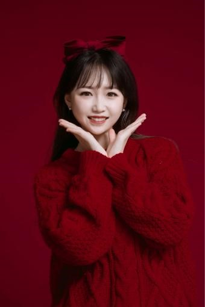
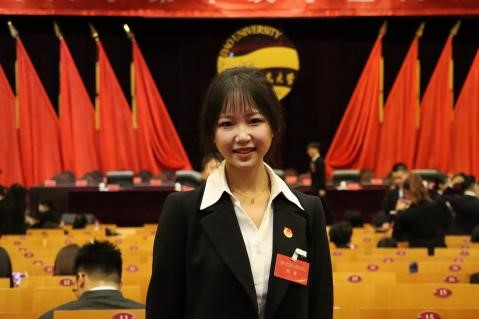
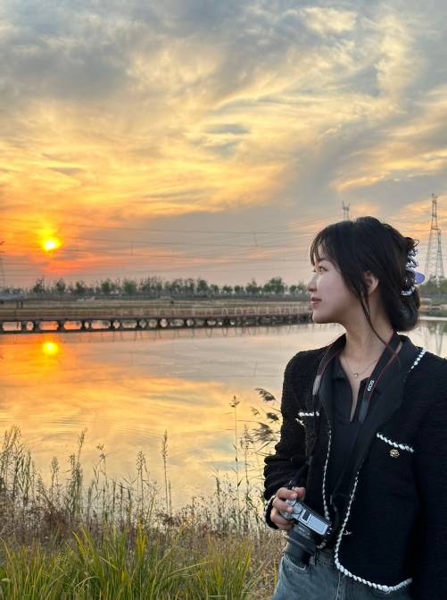

**GAO Rongxi**，A girl from Inner Mongolia, China. 

Bachelor's Degree from Qingdao University (QDU), School of Literature and Journalism and Communication (SLJC).09/2021-06/2025 

Executive Director, SLJC Student Union 06/2023-06/2024

**Expected Degree:** Bachelor of Arts in Journalism \| GPA: 89.85/100 

**Honors:** 1 st Prize of QDU Excellent Scholarships (three consecutive years), QDU Top 100 Outstanding Student Leader (12/2022), Qingdao Top 1000 Outstanding College Student (05/2024)

As a young student with a dream of journalism, I grew up in a family full of books and an open atmosphere. My knowledgeable parents planted the seeds of endless exploration of knowledge and truth for me from an early age. I not only learnt to respect history and cherish culture, but also developed a keen sense of observation and a deep understanding of words.

 

My parents have always upheld the educational philosophy of ‘truthfulness and pragmatism, courage and responsibility’. They encouraged me to not only pursue the truth when facing problems, but also to speak out and stand up for justice. Whenever there is a hot event in society, my parents will guide me to analyse it from multiple angles and teach me how to sift through the complex information to find the true and reliable content, and in this process, I have gradually formed the ability of critical thinking and independent thinking.

In terms of values, I regard ‘fairness, responsibility and compassion’ as the cornerstones of my personal behaviour. I believe that as a journalist, the most important thing is to maintain objectivity and impartiality, and to provide accurate information to the public; at the same time, journalism is not only about delivering news, but also a heavy social responsibility, which requires us to pay attention to the voices of the underprivileged at all times, and to strive for more attention and help for them with our pen and ink. I firmly believe that compassion is a bridge that connects people's hearts and promotes social harmony, and in my study and practice, I constantly remind myself to report every story from a humanistic perspective.

It is this background of upbringing, family education and shaping of values that makes me eager to record the changes of the times with my own brushstrokes, to become a solid bridge connecting the truth and the public, and to contribute my share to the progress of society.

