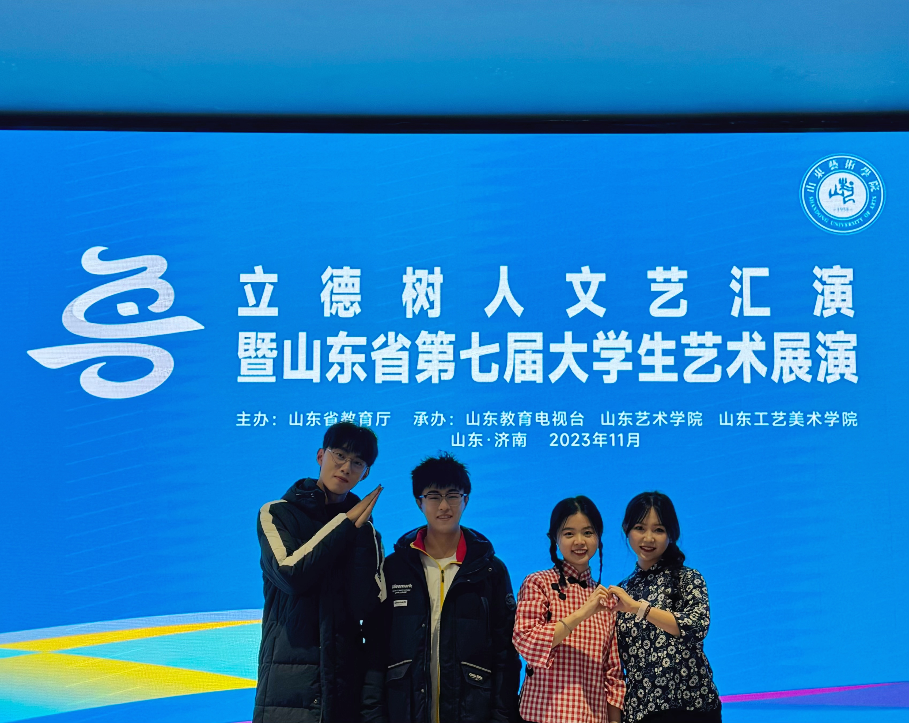

### 1. Honors：
-	1 st Prize of QDU Excellent Scholarships (three consecutive years)
-	QDU Top 100 Outstanding Student Leader (12/2022)
-	Qingdao Top 1000 Outstanding College Student (05/2024)
-	Outstanding Student of Inner Mongolia Autonomous Region（05/2021）
---
### 2. Competition：
-	Shandong College Student Ideological and Political Education Short Video Competition (The 3rd Prize, Top 2%)  （09/2023）
-	1 st Prize (Gold prize) of The 9 th National College Student Innovation and Entrepreneurship Contest  (04/2023-12/2023）
-	1 st Prize of The Recitation Category in Shandong University Students' Art Exhibition  (12/2023）
-	1 st Prize of The Art Practice Workshop of Shandong University Students' Art Exhibition (12/2023）
- 1 st Prize of The Art Practice Workshop of National Student Art Exhibition（06/2024）
---
### 3. Cultural and sports activities：
-	Won the first prize of school-level speech contests for several times
---

