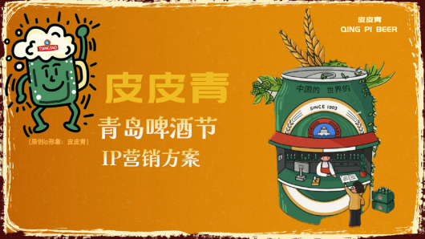

### 1. Videos：
- [‘46 keys，The Story of Ma Huai Long, the Most excellent Police Officer’](https://mp.weixin.qq.com/s/72ckSHyqZY31UkGtyTQpyw)

-	[‘The Greatness of the Ordinary’](https://mp.weixin.qq.com/s/pSbdC8gOaIwUFjfUXB_1Dw)

-	Video series of ‘Outstanding Private Entrepreneurs in Qingdao Shinan District’

    https://mp.weixin.qq.com/s/Qr8xKiJNjwKtp6m7FEukdg

    https://mp.weixin.qq.com/s/H5n6i3baEHE96SoRaxL2YA

-	 Qingdao Shibei District Health Committee Promotional Video

 
-	 ‘2023 Qingdao Transport Tackling Action Large Project Tour - Qingdao Municipal Transport Integration Application Platform’

 
-	[‘The ‘Beauty and Kunlun’ Xinjiang Rural Beauty Revitalisation and Ethnic Unity Practice Group went to Xinjiang Uygur Autonomous Region to carry out teaching activities again.’](https://article.xuexi.cn/articles/index.html?art_id=13604879192180217823&item_id=13604879192180217823&cdn=https%3A%2F%2Fregion-shandong-resource&study_style_id=video_default&pid=&ptype=-1&source=share&share_to=wx_single)

### 2. Writings：
-	[“The whole network relayed the chorus of ‘Beijing Welcomes You’: the familiar melody shows China's self-confidence”](https://mp.weixin.qq.com/s/6sON2kfBzznNHE7gB0aTTg)

-	[“Do you know the beauty of Mount Daze?”](https://mp.weixin.qq.com/s/GSck1Lutm-LFboXds2RZ9w)

-	[‘The ‘Beauty and Kunlun’ Xinjiang Rural Beauty Revitalisation and National Unity Practice Group went to Xinjiang Uygur Autonomous Region to start teaching activities again.’](https://www.guanhai.com.cn/p/269715.html)

### 3. Master plan：
1. IP Marketing Plan for Qingdao International Beer Festival

12/2023

-	Analyzed effects of IP-image-building in previous Qingdao Beer Festivals to conceive new IP images

-	Used various marketing modes to integrate IP images in brand culture promotional strategies; applied UGC (user-generated content) creativity crowdsourcing, co-branding, scene propagation, cross-field cooperation, etc. to implement projects  

2. Advertising Proposal for HBN Retinol Firming Essence Lotion

12/2022

-	Conducted SWOT and PEST analyses to evaluate the product’s market potential and identified its unique features

-	Combined Xiaohongshu, Weibo, WeChat, news and other communication channels to devise marketing strategies

    
### 4. H5:

[‘A round-up of the big news stories of 2023’](https://www.mugeda.com/client/content_preview.html?id=c975b5b2)
