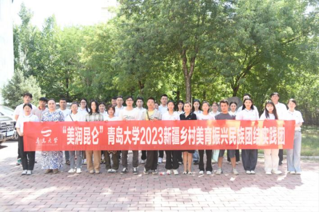

## 1. Splendid Kunlun Mountains -- Mapping Out a New Blueprint for Education and Revitalization of Villages in Southern Xinjiang

04/2023-12/2023

- Popularized Mandarin and gave voluntary art education in Xinjiang, held 10 book donation activities; taught over 10,000 students in total

- Independently drafted 9 articles for project promotion; 3 articles were adopted and issued by national and city-level media; each article received over 10,000 views
  
- The volunteer teaching team was awarded the first prizes of Shandong Art Practice Workshop and National College Student Art Exhibition and Performance
  
- We won The 9 th National College Student Innovation and Entrepreneurship Contest (Gold Award of Shandong Division, Top 1)

---
 
## 2. Shandong College Student Ideological and Political Education Short Video Competition   

09/2023

- Determined the video theme, drafted a proposal and managed the project process
  
- Gathered video material, designed a shooting script and wrote the video description (The 3rd Prize, Top 2%)
  
